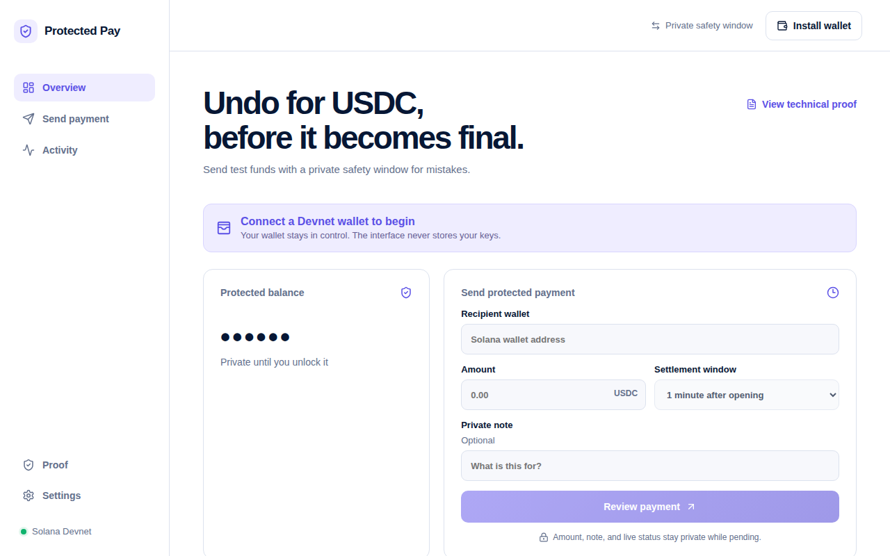

# Protected Pay

Private, reversible Circle USDC payments on Solana, with an automated safety window powered by MagicBlock.

Protected Pay lets a sender place test USDC into per-payment escrow, share a private recipient link, and undo a mistake before settlement. The intended recipient can acknowledge the payment; MagicBlock Crank then advances it without either user remaining online. A settled payment is claimable only by the recipient, while an unacknowledged expired payment is recoverable only by the sender.

> Devnet demonstration only. Circle Devnet USDC has no financial value. This code is not audited or production-ready.

**Live app:** [protected-pay-azure.vercel.app](https://protected-pay-azure.vercel.app) · **Video demo:** [Watch on YouTube](https://youtu.be/8cHFXfzUb-Y)



## Why it exists

Ordinary crypto transfers become difficult or impossible to reverse once broadcast. Protected Pay adds a short, program-enforced safety period while keeping the amount, note commitment, live status, deadlines, task identifier, and aggregate balances inside MagicBlock's authenticated Private ER while the payment is pending.

The project deliberately does **not** claim anonymous or permanently secret payments. Sender, recipient, payment identifier, mint, permission membership, validator, and delegation timing remain public. Terminal state is committed back to Solana in redacted form with a cryptographic commitment.

## Live build status

- Anchor program version 2.2 is deployed on Solana Devnet.
- The production web client is deployed on Vercel with direct `/app` and `/pay` SPA routes.
- Real Circle Devnet USDC funding, delegation, withdrawal, protected send, sender Undo, unattended expiry/recovery, recipient acknowledgement, unattended settlement, and recipient claim have run through the browser product.
- One-hour MagicBlock Session Tokens scope an in-memory signer to Protected Pay. Wallet keys, authentication tokens, session signers, and plaintext notes are never stored in browser receipts.
- Retry-safe checkpoints reconcile prepared signatures and authoritative state before any resend.
- Explicit session revocation closes the token account and invalidates further session-signed actions.

## Deployed identifiers

| Item | Value |
| --- | --- |
| Network | Solana Devnet |
| Protected Pay program | `w1ufT3tzJmo6AwLPUV67qXHGTCzUypT7B8RdHATYDGk` |
| Circle Devnet USDC mint | `4zMMC9srt5Ri5X14GAgXhaHii3GnPAEERYPJgZJDncDU` |
| MagicBlock Private ER | `https://devnet-tee.magicblock.app` |
| MagicBlock validator | `MTEWGuqxUpYZGFJQcp8tLN7x5v9BSeoFHYWQQ3n3xzo` |

## How it works

```text
Sender wallet
  ├─ public Devnet: fund vault, create Session Token, prepare/delegate Payment
  └─ authenticated Private ER: open escrow + schedule six Crank calls
                                      │
                         private recipient link
                                      │
Recipient wallet ── acknowledge ──────┤
                                      │
MagicBlock Crank ── settle or expire ─┘
            ├─ Settled → recipient-only claim
            └─ Expired → sender-only recovery
```

Pending liability lives in the shared `Payment`, so the automated Crank instruction never needs either user's owner-only aggregate `Deposit`. Terminal claims touch only the payment and the claimant's own deposit. Claiming seals the payment, clears its sensitive fields, and leaves a terminal commitment.

## Product flow

1. Connect a Solana wallet in Phantom Testnet Mode.
2. Fund the protected balance with Circle Devnet USDC.
3. Enter a different recipient wallet, an amount, and an optional private note.
4. Review the exact approval sequence and protect the payment.
5. Share the generated `/pay?payment=...` link with the recipient.
6. The recipient authenticates and acknowledges before expiry.
7. After automatic settlement, the recipient claims the test USDC.
8. Before settlement, the sender can Undo; after unattended expiry, only the sender can recover.

The cold sender flow honestly requires one off-chain Query Filtering login message and two public approvals: one bounded Session Token and one Payment preparation/delegation transaction. With a live session, only Payment preparation requires Phantom; private actions use the bounded in-memory signer.

## Run locally

Requirements used by the project:

- Node.js 24
- npm
- Rust/Cargo
- Solana CLI 4.0.1
- Anchor CLI 1.0.2

Install and run:

```bash
npm ci
cp .env.example .env
npm run dev:web -- --host 127.0.0.1 --port 4173
```

Open `http://127.0.0.1:4173`.

No wallet seed phrase or private key belongs in `.env`, the browser app, the repository, or an issue. Private ER authorization is obtained at runtime through the wallet challenge flow.

## Verification

Fast local checks:

```bash
npm run typecheck
npm run build:web
npm run p5:verify:frontend-recovery
npm run p5:verify:payment-receipts
npm run p5:verify:session-keys
cargo test --locked -p protected-pay --lib
```

The guarded scripts in `scripts/` separate unsigned preflight, signed simulation, and broadcast approval. Do not run a `send` script without reviewing its exact scenario and approval flags.

Transaction-backed evidence is indexed in [`artifacts/feasibility`](artifacts/feasibility/README.md). The live browser sequence is recorded in [`artifacts/ui/p5-live-browser-wallet-checklist.md`](artifacts/ui/p5-live-browser-wallet-checklist.md).

The current requirement traceability verdict is recorded in [`artifacts/verification/final-verification-audit.md`](artifacts/verification/final-verification-audit.md).

## Privacy and security boundaries

- Private while pending means access-controlled inside MagicBlock's authenticated Private ER—not anonymous, mainnet-private, or permanently secret.
- Wallet addresses, payment identity, token mint, permissions, delegation metadata, validator, and timing are public.
- Browser recovery data is local to one browser profile and is not a defense against malicious scripts or local device access.
- Optional notes are encrypted into the recipient link; anyone holding the complete link can access its note key.
- Session signers remain in memory, are scoped to this program for one hour, and can be explicitly revoked.
- Test assets only; no fiat settlement, Resolva partnership, multi-token support, audit claim, or mainnet-readiness claim.

## Repository layout

| Path | Purpose |
| --- | --- |
| `programs/protected-pay` | Anchor program and state machine |
| `clients/ts` | Generated TypeScript client |
| `src` | React/Vite sender and recipient product |
| `scripts` | Guarded Devnet/Private ER simulation and verification runners |
| `artifacts/feasibility` | Transaction-backed technical evidence |
| `artifacts/ui` | Browser-wallet evidence and reference captures |
| `context` | Product research, PRD, technical specification, and build plan |

## License

MIT — see [`LICENSE`](LICENSE).
